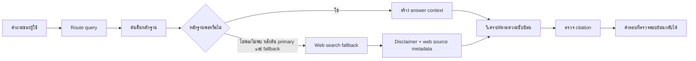

<div align="center">

# ⚖️ PasaduAIagent

### ผู้ช่วย AI สำหรับงานจัดซื้อจัดจ้างและการบริหารพัสดุภาครัฐของไทย

ระบบค้นคืนข้อมูลกฎหมายแบบอ้างอิงได้ พร้อม workflow สำหรับตอบคำถามอย่างมีหลักฐาน ตรวจสอบย้อนกลับได้ และรู้จักบอกเมื่อข้อมูลยังไม่เพียงพอ

<p>
  <a href="./INSTALLATION.md">ติดตั้ง</a> ·
  <a href="./skills/pasadu/SKILL.md">ดู Skill</a> ·
  <a href="./skills/pasadu/pasadu.md">ดู Response Policy</a> ·
  <a href="./docs/pasadu-agent-usage.md">คู่มือการใช้งาน</a>
</p>


</div>

> **หลักคิดของ Pasadu**
>
> ตอบจากเอกสารที่ค้นและตรวจสอบได้ อ้างมาตรา/ข้อ/หัวข้อให้ตรงต้นฉบับ แยกลำดับศักดิ์ของแหล่งอ้างอิง และบอกตรง ๆ เมื่อ repository ยังมีข้อมูลไม่พอสำหรับสรุป

---

## สารบัญ

- [ภาพรวมใน 30 วินาที](#ภาพรวมใน-30-วินาที)
- [จุดเด่นของระบบ](#จุดเด่นของระบบ)
- [Workflow การตอบคำถาม](#workflow-การตอบคำถาม)
- [Repository-first และ web search fallback](#repository-first-และ-web-search-fallback)
- [เริ่มใช้งานอย่างรวดเร็ว](#เริ่มใช้งานอย่างรวดเร็ว)
- [ติดตั้ง](#ติดตั้ง)
- [ใช้ retrieval layer โดยตรง](#ใช้-retrieval-layer-โดยตรง)
- [โครงสร้าง repository](#โครงสร้าง-repository)
- [ชุดข้อมูลอ้างอิง](#ชุดข้อมูลอ้างอิง)
- [รูปแบบคำตอบและ citation](#รูปแบบคำตอบและ-citation)
- [ข้อจำกัดที่ควรรู้](#ข้อจำกัดที่ควรรู้)
- [ตรวจสอบและพัฒนาต่อ](#ตรวจสอบและพัฒนาต่อ)
- [เอกสารที่เกี่ยวข้อง](#เอกสารที่เกี่ยวข้อง)

## ภาพรวมใน 30 วินาที

PasaduAIagent คือ **AI skill + local retrieval workflow** ที่ออกแบบมาเพื่อให้ผู้ช่วย AI ทำงานกับคำถามด้านพัสดุภาครัฐได้อย่างเป็นระบบ โดยเน้น 4 เรื่อง:

| ส่วนประกอบ | ทำหน้าที่อะไร |
| --- | --- |
| **Reference library** | เก็บพระราชบัญญัติ ระเบียบ กฎกระทรวง และหนังสือเวียนที่อยู่ในขอบเขตของโปรเจกต์ |
| **Routing layer** | เลือกแหล่งอ้างอิงหลักตามคำสำคัญ มาตรา ข้อ และประเด็นของคำถาม |
| **Retrieval layer** | ค้นคืน section/chunk ที่เกี่ยวข้องจากดัชนีแบบ section-aware |
| **Answer guardrails** | บังคับให้คำตอบแยกข้อเท็จจริงจากการตีความ พร้อมตรวจ citation ก่อนส่ง |

### เส้นทางข้อมูล



## จุดเด่นของระบบ

<table>
<tr>
<td width="50%">

### 🔎 Evidence-first

เริ่มจากหลักฐานใน repository ก่อนเสมอ ไม่รีบคาดเดาคำตอบจากความจำของโมเดล

</td>
<td width="50%">

### 🧭 Routing ตามประเด็น

แยกคำถามเรื่องมาตรา ระเบียบ วิธีเฉพาะเจาะจง อุทธรณ์ และคุณสมบัติผู้ยื่นเสนอราคาไปยังแหล่งที่เหมาะสม

</td>
</tr>
<tr>
<td>

### 🧠 Reasoning แบบพอดี

ใช้ evidence packet ชุดเดียวสำหรับการค้นคืน การอธิบาย และการปรับบทกฎหมายเข้ากับข้อเท็จจริง หากมีความขัดแย้งหรือความกำกวมที่มีนัยสำคัญ ให้วิเคราะห์ต่อในบทสนทนาปัจจุบัน

</td>
<td>

### ✅ Citation ตรวจได้

ตรวจการอ้างอิงกับดัชนีภายในด้วย `cite_check.py` เพื่อช่วยลด citation ที่ไม่ตรงกับเอกสารต้นทาง

</td>
</tr>
</table>

## Workflow การตอบคำถาม

Pasadu ใช้บทสนทนาปัจจุบันเป็นตัวประสานงาน และเลือกเส้นทางที่เหมาะกับลักษณะคำถาม:

```text
คำถาม
  │
  ├─ ค้นคืน / อธิบายตรง ๆ       → evidence packet → draft answer
  │
  ├─ ใช้กฎหมายกับข้อเท็จจริง     → evidence packet → current conversation → answer
  │
  └─ ขัดแย้ง / กำกวม / หลายบท    → evidence packet → complex analysis → answer
                                             │
                                             └→ cite_check ก่อนส่งทุกครั้ง
```

### ระดับการทำงาน

| สถานการณ์ | เส้นทางที่ใช้ | ผลลัพธ์ที่คาดหวัง |
| --- | --- | --- |
| ต้องการมาตรา ข้อ หรือขั้นตอนที่ระบุชัด | Direct retrieval | สรุปจาก evidence packet พร้อม citation |
| ต้องวิเคราะห์ว่ากฎหมายใช้กับกรณีนี้อย่างไร | บทสนทนาปัจจุบัน + evidence packet | แยกหลักกฎหมาย ข้อเท็จจริง เงื่อนไข และข้อสรุปโดยไม่ส่งต่องาน |
| มีหลายบทต้องอ่านประกอบกัน หรือมีความกำกวมสำคัญ | วิเคราะห์ต่อในบทสนทนาปัจจุบัน | อธิบายจุดขัดแย้ง สมมติฐาน และความไม่แน่นอนอย่างชัดเจน |
| ค้นแล้วไม่มีหลักฐานเพียงพอ | Safe failure | แจ้งข้อมูลที่ขาด โดยไม่แต่งคำตอบขึ้นเอง |

## Repository-first และ web search fallback

Pasadu ต้อง route และค้นจาก repository ก่อนเสมอ โดยตรวจ source หลักและ fallback source ที่กำหนดไว้ใน routing policy ให้ครบ หาก repository มีหลักฐานเพียงพอ ให้ตอบจาก repository และไม่เพิ่ม web source

Web search ใช้ได้เฉพาะเมื่อค้น repository ตามปกติแล้ว ตรวจ primary/fallback ครบแล้ว และหลักฐานยังไม่พอหรือไม่มีเอกสารที่เกี่ยวข้อง หากข้อเท็จจริงยังขาดจนต้องถามผู้ใช้ ให้ถามก่อนและยังไม่ใช้ web search การ fallback นี้เป็นการค้นแบบอ่านอย่างเดียวในบทสนทนาปัจจุบัน

ถ้า repository ตอบได้เพียงบางส่วน ต้องแบ่งคำตอบเป็น `Repository source` และ `Web source` ห้ามผสม citation หรือทำให้ web source ดูเหมือนเป็นเอกสารใน repository

ทุกคำตอบที่ใช้ web search ต้องขึ้นต้นด้วยข้อความนี้แบบตรงตัว:

> คำตอบนี้ใช้ข้อมูลจาก web search ไม่ได้ใช้ฐานข้อมูลของ repository ข้อมูลมีโอกาสคลาดเคลื่อน โปรดตรวจสอบกับแหล่งทางการอีกครั้ง

สำหรับแต่ละ `web source` ต้องแสดงชื่อเว็บไซต์หรือหน่วยงานเจ้าของแหล่งข้อมูล, URL โดยตรง, วันที่เข้าถึงถ้าระบบรองรับ, ชื่อกฎหมาย/ระเบียบ/กฎกระทรวง/หนังสือเวียน/ประกาศที่ตรวจสอบได้ และมาตรา/ข้อ/หัวข้อ/เลขที่เอกสารที่ตรวจสอบได้ ห้ามสร้างข้อมูลเหล่านี้ขึ้นเอง หากยืนยันไม่ได้ให้ระบุว่าไม่สามารถยืนยันได้ ลำดับแหล่งที่ต้องการคือเว็บไซต์รัฐหรือราชกิจจานุเบกษา, เว็บไซต์ทางการของหน่วยงานเจ้าของเรื่อง, แล้วจึงแหล่งกฎหมายที่น่าเชื่อถืออื่นเมื่อหาแหล่งทางการไม่ได้

หาก web sources ขัดแย้งกัน ต้องแสดงทั้งสองแหล่งและอธิบายความขัดแย้ง คำถามที่กระทบสิทธิ หน้าที่ งบประมาณ สัญญา หรือความรับผิด ต้องเตือนให้ตรวจต้นฉบับทางการและหน่วยงานผู้มีอำนาจอีกครั้ง

### สถาปัตยกรรม standalone

Pasadu ไม่ pin โมเดลและไม่พึ่ง custom subagent จึงใช้โมเดลและ reasoning ที่ผู้ใช้เลือกใน host ปัจจุบัน งาน retrieval ใช้ Python แบบ deterministic ส่วนการวิเคราะห์ทั้งหมดอยู่ในบทสนทนาปัจจุบัน

> **หมายเหตุ:** Phase 1 ใช้ข้อมูลจาก repository เป็นหลัก และเป็น workflow แบบอ่านอย่างเดียว (read-only) โดยมี web search fallback แบบติดป้ายชัดเจนเมื่อหลักฐานใน repository ไม่พอ

## เริ่มใช้งานอย่างรวดเร็ว

สำหรับผู้ใช้ใหม่ที่ไม่ต้องการอ่านรายละเอียดทางเทคนิค ให้เริ่มที่ [เริ่มต้นใช้งาน.txt](<./newbie user guide/เริ่มต้นใช้งาน.txt>) แล้วคัดลอก [prompt.txt](<./newbie user guide/prompt.txt>) ไปสั่ง Codex ได้เลย ส่วน `INSTALLATION.md` เป็นคู่มือปฏิบัติการที่ Codex จะอ่านและทำตามให้

### 1. ติดตั้ง global บน Codex สำหรับ Windows

ผู้ใช้ทั่วไปไม่ต้องติดตั้ง Node.js, npm หรือ Git ให้เปิด task ใหม่แล้วคัดลอก
[`newbie user guide/prompt.txt`](<./newbie user guide/prompt.txt>) ไปให้ Codex ดำเนินการดาวน์โหลด
ZIP, ติดตั้ง global และตรวจไฟล์ให้จนจบ

จากนั้นปิด–เปิด Codex หรือเริ่ม task ใหม่ แล้วถามได้ทันที เช่น:

```text
คณะกรรมการตรวจรับพัสดุมีหน้าที่อะไร
```

### 2. เรียกใช้งานแบบ manual

```text
/pasadu มาตรา 56 ใช้กรณีใด
/passadu มาตรา 56 ใช้กรณีใด
$pasadu มาตรา 56 ใช้กรณีใด
```

โดยทั่วไปไม่จำเป็นต้องพิมพ์ชื่อ skill — Codex ควร auto-trigger จาก intent ของคำถามเมื่อคำถามอยู่ในขอบเขตที่เกี่ยวข้อง

## ติดตั้ง

คู่มือติดตั้งฉบับเต็มครอบคลุม Codex Windows App, Codex CLI, Claude Code, Gemini CLI และข้อจำกัดของ web-only hosts:

➡️ **[อ่าน INSTALLATION.md](./INSTALLATION.md)**

### ให้ Codex ติดตั้งแทน (แนะนำ)

คัดลอก [`newbie user guide/prompt.txt`](<./newbie user guide/prompt.txt>) ไปให้ Codex ปลายทาง
วิธีนี้ใช้ HTTPS และ PowerShell ที่มีใน Windows ไม่ต้องมี Node.js, npm หรือ Git

Codex จะใช้ [`scripts/install-pasadu.ps1`](./scripts/install-pasadu.ps1) เพื่อตรวจ source,
staging สำเนาใหม่ และเก็บ backup ก่อนอัปเดต

ตำแหน่ง Codex global คือ `%USERPROFILE%\.agents\skills\pasadu` ดูคำสั่งสำหรับ Claude Code, Gemini CLI, update, remove และ Git-managed fallback ใน [INSTALLATION.md](./INSTALLATION.md)

เครื่องที่มี Node.js อยู่แล้วสามารถเลือกใช้ Skills CLI ตาม [INSTALLATION.md](./INSTALLATION.md)
สำหรับการอัปเดตกฎหมายครั้งต่อไปใช้
[`newbie user guide/update-prompt.txt`](<./newbie user guide/update-prompt.txt>)

ชุดข้อมูลที่ติดตั้งมี [`data/release.json`](./skills/pasadu/data/release.json) สำหรับรายงาน
package release และวันที่ snapshot ของ reference ทุกครั้งที่ติดตั้งหรืออัปเดต

### ข้อกำหนดขั้นต่ำ

- Codex, Claude Code หรือ Gemini CLI ตามแพลตฟอร์มที่ต้องการใช้
- อินเทอร์เน็ตและสิทธิ์เขียน user-level skill directory
- Node.js/npm ต้องใช้เฉพาะเมื่อเลือกช่องทาง Skills CLI
- Git ต้องใช้เฉพาะเมื่อเลือก Git-managed installation
- Python 3.10 ขึ้นไป หากต้องการรัน retrieval scripts, tests หรือ evaluation ใน environment ที่ไม่มี bundled runtime

> Codex Desktop มี bundled Python runtime สำหรับ session ที่รองรับ จึงรัน retrieval scripts และ tests ได้แม้ผู้ใช้ไม่ได้ติดตั้ง Python เพิ่มเอง ส่วน CLI/agent อื่นต้องตรวจว่าเปิดใช้ Python runtime หรือมี Python 3.10+ ใน PATH; หากไม่มี ให้ใช้ skill อ่าน reference โดยตรงได้ แต่จะรัน scripts และชุดทดสอบไม่ได้

## ใช้ retrieval layer โดยตรง

สคริปต์ทั้งหมดอยู่ใน [`skills/pasadu/scripts/pasadu/`](./skills/pasadu/scripts/pasadu/) และใช้ index ที่อยู่ใน [`skills/pasadu/data/index/`](./skills/pasadu/data/index/)

### Route คำถามไปยังแหล่งอ้างอิง

```powershell
python -B skills/pasadu/scripts/pasadu/route_query.py "มาตรา 56 ใช้กรณีใด"
```

เพิ่ม `--json` หากต้องการผลลัพธ์สำหรับนำไปใช้งานต่อในระบบอื่น

### ค้นคืนหลักฐานที่เกี่ยวข้อง

```powershell
python -B skills/pasadu/scripts/pasadu/retrieve.py "หน้าที่ของคณะกรรมการตรวจรับพัสดุ" --limit 5
```

### สร้าง context สำหรับผู้ช่วย AI

```powershell
python -B skills/pasadu/scripts/pasadu/answer_context.py "การอุทธรณ์ผลการจัดซื้อจัดจ้างทำได้อย่างไร" --limit 5
```

### ตรวจ citation ของคำตอบ

```powershell
python -B skills/pasadu/scripts/pasadu/cite_check.py --text "คำตอบที่มี citation อยู่ในข้อความ"
```

หรืออ่านคำตอบจากไฟล์ UTF-8:

```powershell
python -B skills/pasadu/scripts/pasadu/cite_check.py --file answer.txt
```

## โครงสร้าง repository

```text
PassaduAIagent/
├── skills/pasadu/              # standalone skill ที่ Skills CLI ติดตั้ง
│   ├── SKILL.md                # trigger และ workflow หลัก
│   ├── pasadu.md               # policy และรูปแบบคำตอบ
│   ├── agents/openai.yaml      # metadata สำหรับ UI
│   ├── reference/              # กฎหมาย กฎกระทรวง และหนังสือเวียน
│   ├── data/index/             # ดัชนี routing/retrieval
│   └── scripts/pasadu/         # retrieval และ citation tools
├── AGENTS.md                   # กติกาสำหรับพัฒนา repository
├── INSTALLATION.md             # คู่มือติดตั้งทุกแพลตฟอร์ม
├── reference/ECPP/             # เอกสารประกอบที่ยังไม่อยู่ใน runtime routing
├── evals/                      # คำถามและ citation ที่คาดหวัง
├── tests/                      # ชุดทดสอบสคริปต์
├── docs/                       # คู่มือ การออกแบบ และ roadmap
└── how2agent/                  # คู่มือเริ่มต้นใช้งานแบบ visual
```

## ชุดข้อมูลอ้างอิง

คลังข้อมูลปัจจุบันเน้นกฎหมายและเอกสารที่จำเป็นต่อการตอบคำถาม procurement ระยะเริ่มต้น:

| กลุ่ม | เอกสารหลัก | ประเด็นที่ครอบคลุม |
| --- | --- | --- |
| พระราชบัญญัติ | พ.ร.บ. การจัดซื้อจัดจ้างฯ พ.ศ. 2560 | หลักการ อำนาจ วิธีจัดซื้อจัดจ้าง และการอุทธรณ์ |
| ระเบียบ | ระเบียบกระทรวงการคลังฯ พ.ศ. 2560 | ขั้นตอนปฏิบัติ รายละเอียด และข้อกำหนดทั่วไป |
| ระเบียบฉบับแก้ไข | ระเบียบฯ ฉบับที่ 3 พ.ศ. 2569 | ข้อ 190–191 และประเด็นที่มีการปรับปรุง |
| กฎกระทรวง | กฎกระทรวงกำหนดวิธีเฉพาะเจาะจงฯ | วิธีเฉพาะเจาะจง วงเงินเล็กน้อย และผู้ตรวจรับ |
| หนังสือเวียน | ว 214 และ ว 367 | คุณสมบัติผู้ยื่นเสนอราคา และหลักเกณฑ์ด้านการอุทธรณ์ |

การเพิ่ม reference ใหม่ควรอัปเดต metadata, source registry, routing tests และสร้าง index ใหม่ให้ครบชุด

## รูปแบบคำตอบและ citation

คำตอบที่ดีของ Pasadu ควรมีลำดับดังนี้:

1. **คำตอบสั้นก่อน** — บอกผลลัพธ์ที่ผู้ถามต้องการรู้
2. **ฐานกฎหมาย** — ระบุมาตรา ข้อ หรือหัวข้อที่เกี่ยวข้อง
3. **เงื่อนไขและข้อยกเว้น** — ระบุให้ชัดว่าหลักเกณฑ์ใช้เมื่อใดและไม่ใช้เมื่อใด
4. **การประยุกต์กับกรณี** — แยกข้อเท็จจริงออกจากการตีความ
5. **ข้อควรตรวจต่อ** — ชี้ข้อมูลที่ยังขาดหรือควรตรวจเอกสารทางการเพิ่มเติม

Citation ต้องสอดคล้องกับ section ที่มีอยู่จริงใน index และไม่ควรอ้างเกินกว่าหลักฐานที่ค้นได้ หากค้นไม่พบ ให้ตอบว่าไม่พบในชุดเอกสารปัจจุบันแทนการคาดเดา

## ข้อจำกัดที่ควรรู้

- ขอบเขตความรู้ขึ้นอยู่กับเอกสารที่อยู่ใน `reference/` และ index ที่สร้างไว้ใน repository
- web search fallback ต้องทำตามเงื่อนไข repository-first และยังไม่มีการตรวจสอบเอกสารภายนอกแบบอัตโนมัติแทนการตรวจหน้าเว็บโดยผู้ปฏิบัติงาน
- ยังไม่มี chatbot runtime แบบเต็มรูปแบบ — repository นี้เป็น skill และ retrieval foundation
- คำตอบที่กระทบสิทธิ หน้าที่ งบประมาณ สัญญา หรือความรับผิด ควรตรวจต้นฉบับทางการและหน่วยงานผู้มีอำนาจอีกครั้ง
- การเปลี่ยนแปลงเอกสารอ้างอิงต้องทำอย่างระมัดระวัง เพราะมีผลต่อ routing, citation และผล evaluation

## ตรวจสอบและพัฒนาต่อ

### รัน tests

```powershell
python -B -m unittest discover -s tests
```

### รัน evaluation queries

```powershell
python -B skills/pasadu/scripts/pasadu/eval_queries.py
```

### สร้าง index ใหม่

```powershell
python -B skills/pasadu/scripts/pasadu/build_index.py
```

ก่อนส่งการเปลี่ยนแปลงควรตรวจอย่างน้อย:

- retrieval ค้น section สำคัญได้จริง
- routing ชี้ source หลักและ source ประกอบถูกต้อง
- citation ผ่าน `cite_check.py`
- tests และ evaluation ไม่ถดถอย
- ไม่เผลอแก้สาระของกฎหมายจากการจัดรูปแบบเอกสาร

## เอกสารที่เกี่ยวข้อง

| เอกสาร | ใช้เมื่อ |
| --- | --- |
| [`newbie user guide/เริ่มต้นใช้งาน.txt`](<./newbie user guide/เริ่มต้นใช้งาน.txt>) | ผู้ใช้ใหม่ต้องการเริ่มติดตั้งแบบสั้นที่สุด |
| [`newbie user guide/prompt.txt`](<./newbie user guide/prompt.txt>) | ผู้ใช้ใหม่ต้องการให้ Codex ดำเนินการติดตั้งให้ |
| [`INSTALLATION.md`](./INSTALLATION.md) | ต้องการติดตั้งหรือแก้ปัญหาแต่ละแพลตฟอร์ม |
| [`skills/pasadu/SKILL.md`](./skills/pasadu/SKILL.md) | ต้องการเข้าใจกติกา trigger และ workflow ของ skill |
| [`skills/pasadu/pasadu.md`](./skills/pasadu/pasadu.md) | ต้องการดู response policy และ guardrails |
| [`docs/pasadu-agent-usage.md`](./docs/pasadu-agent-usage.md) | ต้องการดูสถานะปัจจุบันและ roadmap |
| [`docs/token-usage.md`](./docs/token-usage.md) | ต้องการเข้าใจการใช้ context และ token |
| [`how2agent/index.html`](./how2agent/index.html) | ต้องการคู่มือเริ่มต้นใช้งานแบบภาพ |

---

<div align="center">

**Pasadu — เปลี่ยนคำถามด้านพัสดุให้กลายเป็นคำตอบที่มีหลักฐาน**

<sub>Phase 1 · Evidence-first · Read-only · Built for Thai public procurement workflows</sub>

</div>
